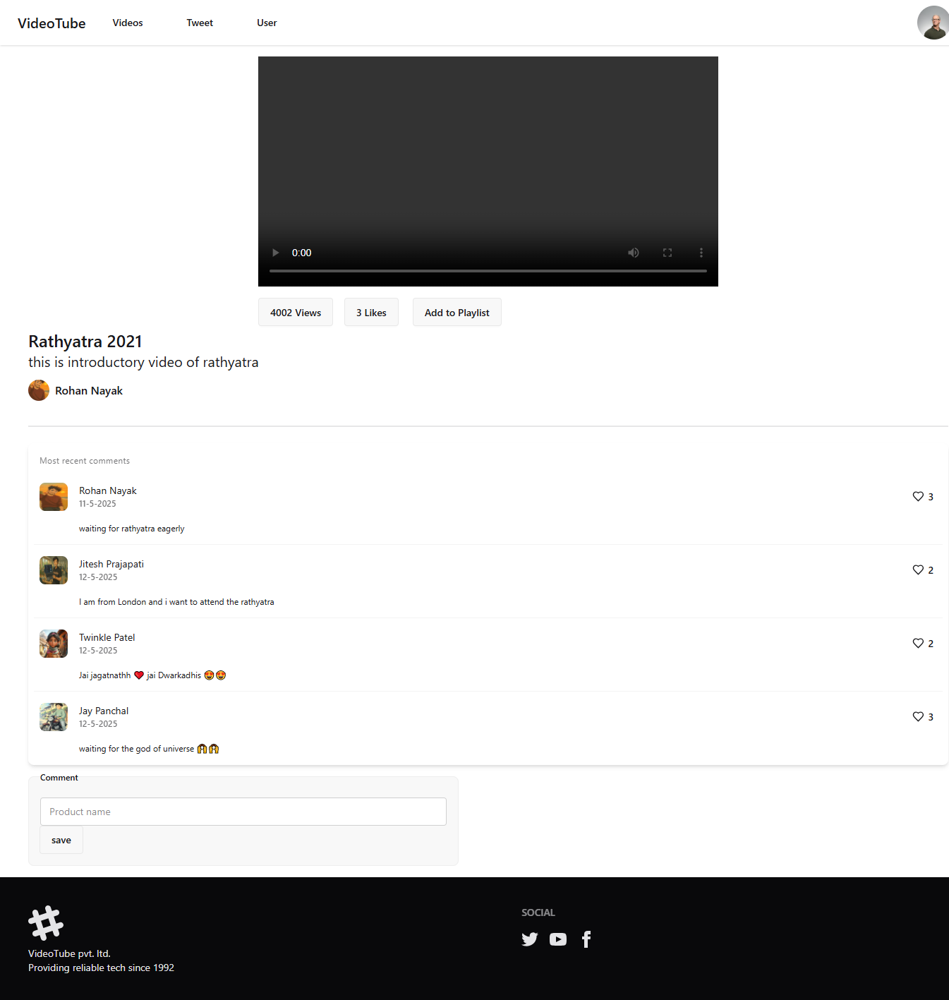
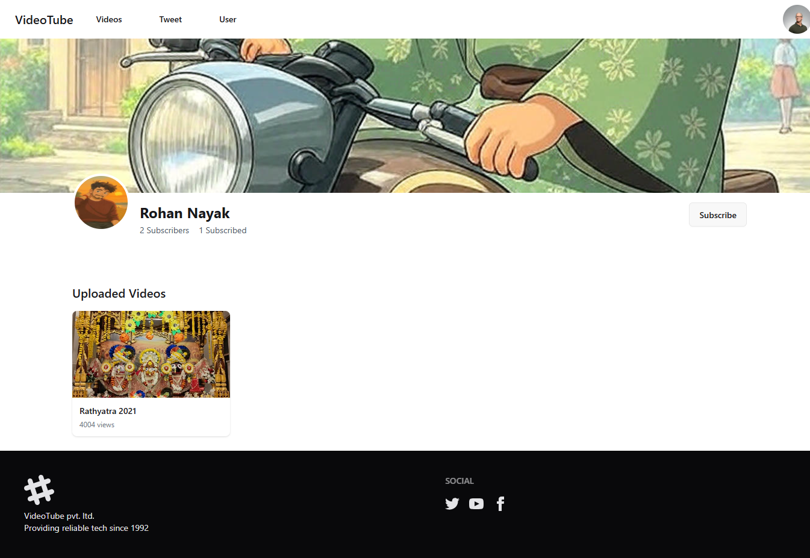
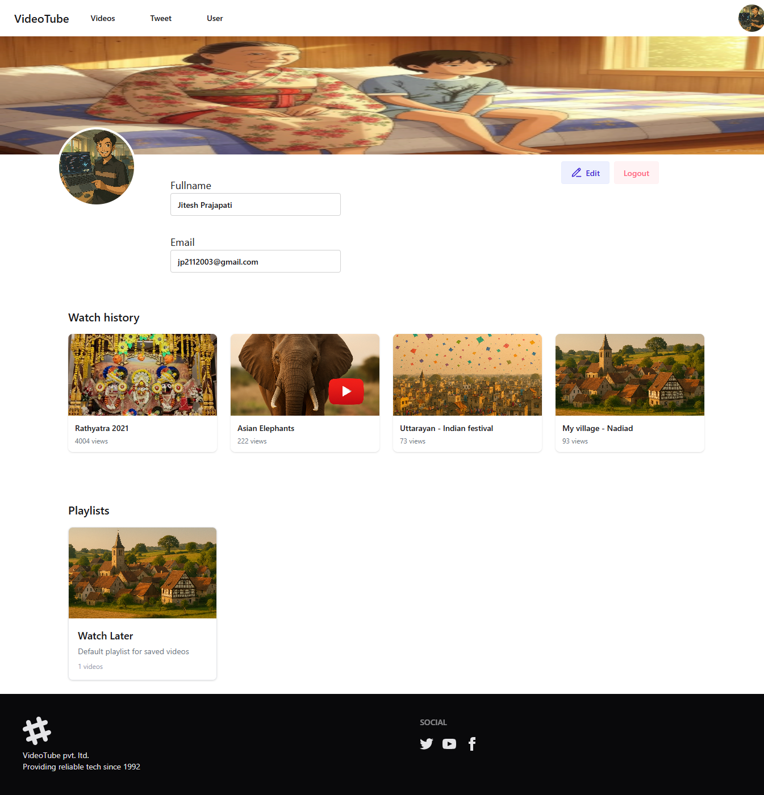

# 🎬 VideoTube - YouTube Clone (Frontend)

This is a **YouTube Clone** frontend project built using **React.js**. It replicates core YouTube functionalities like video streaming, playlists, comments, likes, and user profile management. The UI is designed using **daisyUI**, a component library built on Tailwind CSS.

---

## 🚀 Features

### ✅ Pages & Functionalities

- **Homepage**
  - Displays list of videos.
  - Supports conditional rendering for various user interactions.

- **Individual Video Page**
  - Shows video with comments.
  - Features:
    - Like a video
    - Add to Playlist
    - Delete (if current user is the owner)

- **User Profile**
  - View and update profile details.
  - Subscribe/unsubscribe to other users.
  - Change password functionality.

- **Playlists**
  - Create and manage playlists.
  - Includes a default **"Watch Later"** playlist.
  - Add videos to any playlist.

- **Tweet System**
  - Users can:
    - Post tweets
    - Like tweets

---

## 🛠️ Technical Highlights

- **React.js** for component-based architecture.
- **SessionStorage** for managing authentication state.
- **daisyUI** for clean and responsive UI components.
- **utils.js** for reusable API call functions (centralized API logic).
- Full **conditional rendering** for user-specific views and actions.

---

## 📸 Screenshots

