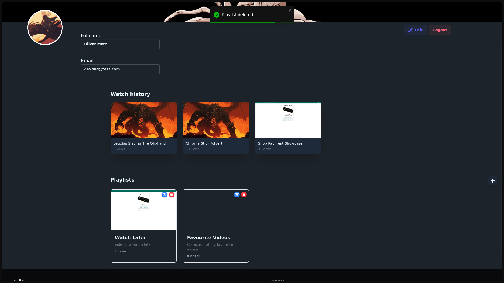
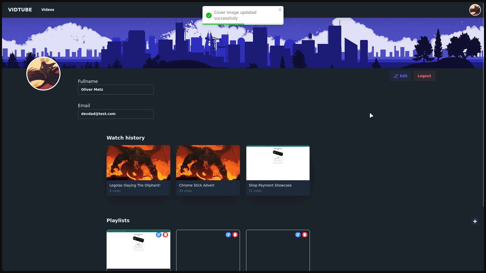

# 🎬 VIDTUBE — YouTube Clone (Frontend)

#### A modern YouTube-like video platform frontend built with React.js, designed to replicate core YouTube functionalities such as video playback, playlists, comments, likes, and user profile management. The interface is crafted with Tailwind CSS and daisyUI, providing a sleek and responsive user experience.

---

<details>
<summary>📸 Screenshots</summary>








</details>

---

## 🚀 Features

### 📄 Pages & Functionalities

- **🏠 Homepage**
  - Displays a list of available videos.
  - Conditional rendering for authenticated users.

- **🎥 Individual Video Page**
  - Embedded video player with comment section.
  - Actions:
    - 👍 Like a video and comments
    - 📂 Add to Playlists, Either default Watch Later playlist or create a new playlist
    - 🗑 Delete Likes and Comments _(if owner)_
    - 🗑 Delete video _(if owner)_

- **👤 User Profile**
  - View and update personal details.
  - Subscribe/unsubscribe to channels.
  - Change password functionality.

- **📜 Playlists**
  - Keep track of watched videos with watch history.
  - Create, update, and delete playlists.
  - Remove videos from playlists.
  - Includes a default **"Watch Later"** playlist.
  - Add videos to any playlist.

---

## 🛠️ Tech Stack & Tools

| Technology                                                                                                                     | Description                         |
| ------------------------------------------------------------------------------------------------------------------------------ | ----------------------------------- |
|  **React.js**                        | Component-based UI development      |
|  **Tailwind CSS** | Utility-first CSS framework         |
|  **daisyUI**                    | Prebuilt UI components for Tailwind |
|  **JavaScript (ES6+)** | Core language                       |
|  **Vite**                                | Fast development build tool         |
|  **HTML5**                            | Markup                              |
|  **CSS3**                                | Styling                             |

---

## 🧠 Technical Highlights

- **Component-based architecture** for modular code.
- **SessionStorage** for authentication persistence.
- **Centralized API utility functions** in `utils.js`.
- Fully **responsive** with mobile-first design.
- **Conditional rendering** based on authentication & permissions.

---

## 📦 Installation & Setup

1. **Clone the repository**

```bash
  git clone https://github.com/DevDad-Main/VIDTUBE-Frontend.git
  cd VIDTUBE-Frontend
```

2. **Install dependencies**

```bash
  npm install
```

3. **Environment Variables**
   > Create a `.env` file in the root directory.

```bash
  VITE_API_BASE_URL=http://localhost:3000
```

3. **Start the development server**

```bash
  npm run dev
```

> The API will be live at `http://localhost:3000`

---

🧑‍💻 Author

Olly – Aspiring Junior Backend Developer

📧 softwaredevdad@gmail.com

<!-- 🌐 https://devdad.org -->

---

📄 License

This project is licensed under the MIT License.

---

🙌 Contributing

Pull requests are welcome! For major changes, please open an issue first to discuss what you would like to change.
